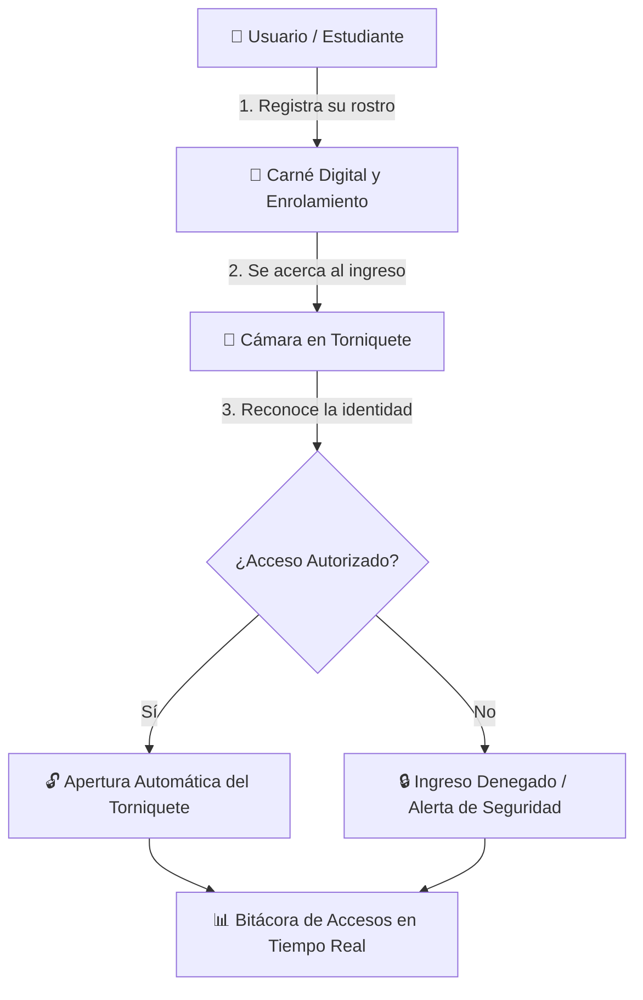

# 🎓 SCAI - Sistema de Control de Acceso Inteligente

> **UNIMINUTO Sede Ibagué** · Control Peatonal con Reconocimiento Facial

---

## 📌 ¿Qué es SCAI?

**SCAI** es una solución tecnológica creada para agilizar y asegurar la entrada y salida de la comunidad universitaria (estudiantes, docentes, administrativos y personal de seguridad) a través de los torniquetes peatonales en la **UNIMINUTO Sede Ibagué**.

En lugar de depender únicamente de carnés físicos que pueden olvidarse, perderse o prestarse, el sistema valida la identidad de la persona en cuestión de segundos utilizando **reconocimiento facial inteligente**.

---

## 🔄 ¿Cómo Funciona el Sistema?

---

## 🌟 Módulos y Funcionalidades

### 📱 1. Carné Digital y Registro Facial
* **Carné Universitario Móvil:** Cada estudiante y docente dispone de su carné interactivo con sus datos y foto de perfil.
* **Registro de Rostro Guiado:** Proceso sencillo para capturar los rasgos faciales desde la cámara del celular o computadora con el consentimiento del usuario.

### 🎥 2. Estación de Lectura e Ingreso (Torniquetes)
* **Validación al Instante:** Al colocarse frente a la cámara del torniquete, el sistema verifica la identidad e indica si la persona tiene acceso permitido.
* **Control de Emergencia:** Permite a la guardia de seguridad dar un pase manual o supervisar accesos en casos especiales.

### 📊 3. Panel de Administración y Seguridad
* **Bitácora de Entradas y Salidas:** Registro transparente con fecha, hora y punto de acceso de cada persona.
* **Estadísticas de Flujo:** Gráficas para conocer el aforo del campus y las horas pico de ingreso.
* **Gestión Institucional:** Control de roles y perfiles para el equipo de administración.

---

## 👥 Beneficios por Usuario

| Usuario | Beneficio Principal |
| :--- | :--- |
| 🎓 **Estudiantes y Docentes** | Ingreso rápido, cómodo y sin contacto. ¡Olvídate de hacer filas o perder tu carné! |
| 🛡️ **Guardias de Seguridad** | Monitoreo claro de quién entra y sale, con alertas ante accesos no autorizados. |
| 🏛️ **Administración** | Reportes precisos y mayor control de la seguridad dentro de las instalaciones. |

---

## 📍 Ubicación y Proyecto

Desarrollado como iniciativa de investigación aplicada para la **UNIMINUTO Sede Ibagué** (Punto de acceso en torniquetes de la Carrera 5a).
